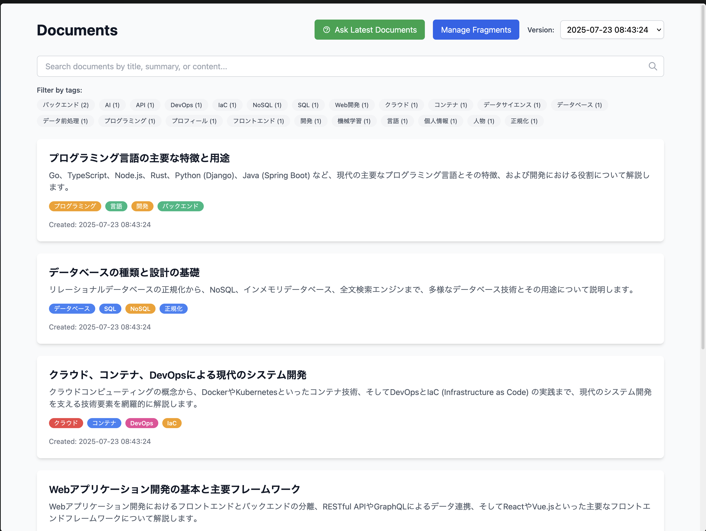

# Insight

Insightは、フラグメント（断片的な情報）から構造化されたドキュメントを自動生成し、AI駆動の質問応答機能を提供するツールです。



## 主な機能

- **フラグメント管理**: 断片的な情報を記録・管理
- **AI ドキュメント生成**: フラグメントから構造化されたドキュメントを自動作成
- **AI フラグメント圧縮**: 類似フラグメントの統合と低価値フラグメントの削除
- **質問応答システム**: ドキュメントに対するAI駆動Q&A
- **タグシステム**: 自動タグ付けによる分類・検索
- **バージョン管理**: ドキュメントのバージョン履歴
- **Web UI**: 直感的なWebインターフェース
- **CLI**: コマンドライン操作

## 必要な環境

- Go 1.24.5+
- [mise](https://mise.jdx.dev/) (推奨)
- Google Generative AI API キー

## セットアップ

### 1. リポジトリのクローン

```bash
git clone <repository-url>
cd insight
```

### 2. 依存関係のインストール

```bash
go mod tidy
```

### 3. 環境変数の設定

Google Generative AI APIキーを設定してください：

```bash
export GEMINI_API_KEY="your-api-key-here"
```

### 4. データベースの初期化

```bash
# miseを使用する場合
mise run migrate

# 直接実行する場合
go run cmd/migrate/main.go
```

## 使用方法

### Web UI

Webアプリケーションを起動：

```bash
# ホットリロード付きで起動（開発時）
mise watch web -r

# 通常起動
mise run web
# または
go run cmd/web/main.go
```

ブラウザで `http://localhost:8084` にアクセスしてください。

### CLI

#### フラグメント操作

```bash
# フラグメント作成
mise run cli -- fragment create --content "Go言語は並行処理が得意です"

# フラグメント一覧
mise run cli -- fragment list

# フラグメント削除
mise run cli -- fragment delete --id 1
```

#### ドキュメント操作

```bash
# ドキュメント一覧
mise run cli -- document list

# ドキュメント詳細
mise run cli -- document show --id 1
```

#### AI操作

```bash
# フラグメントからドキュメント生成
mise run cli -- ai create

# フラグメント圧縮
mise run cli -- ai compress
```

### mise タスク

プロジェクトでは以下のmiseタスクが利用可能です：

```bash
# Webサーバー起動
mise run web

# CLI実行
mise run cli

# データベース初期化
mise run migrate

# データベースリセット
mise run reset

# コードフォーマット
mise run format
```

## アーキテクチャ

```
insight/
├── cmd/                    # アプリケーションエントリーポイント
│   ├── cli/               # CLIアプリケーション
│   ├── migrate/           # データベース初期化
│   └── web/               # Webサーバー
├── src/                   # コアロジック
│   ├── ai/                # AI関連サービス
│   │   ├── client.go          # AI クライアント
│   │   ├── document_generator.go  # ドキュメント生成
│   │   ├── document_service.go    # ファサードサービス
│   │   ├── fragment_compressor.go # フラグメント圧縮
│   │   └── qa_service.go          # 質問応答サービス
│   ├── db/                # データベース接続
│   ├── models/            # データモデル
│   └── usecase/           # ビジネスロジック
└── web/                   # Webアセット
    ├── static/            # 静的ファイル
    └── templates/         # HTMLテンプレート
```

## API エンドポイント

### フラグメント

- `GET /fragments` - フラグメント一覧ページ
- `POST /fragments` - フラグメント作成
- `DELETE /fragments/{id}` - フラグメント削除

### ドキュメント

- `GET /documents` - ドキュメント一覧ページ
- `GET /documents/{id}` - ドキュメント詳細ページ
- `POST /api/documents/{id}/ask` - 個別ドキュメントQ&A
- `POST /api/documents/ask` - 全ドキュメントQ&A（最新バージョンのみ）

### AI

- `POST /api/ai/create` - ドキュメント生成
- `POST /api/ai/compress` - フラグメント圧縮

## データベース

SQLiteを使用してデータを永続化します：

- **フラグメント**: 断片的な情報
- **ドキュメント**: 生成された構造化ドキュメント
- **タグ**: 分類用タグ（多対多リレーション）

## AI機能

### ドキュメント生成

フラグメントを分析し、関連するものを統合して構造化されたドキュメントを生成：

- 関連フラグメントのグループ化
- 背景情報の補完
- 自動タグ付け
- Markdown形式での出力

### フラグメント圧縮

類似フラグメントの統合と低価値フラグメントの削除：

- 重複内容の検出・統合
- 情報量の少ないフラグメントの削除
- データ品質の向上

### 質問応答

ドキュメント内容に基づく質問応答：

- 個別ドキュメントへの質問
- 最新バージョン全ドキュメントへの質問
- Web検索との連携（オプション）

## 開発

### コードフォーマット

```bash
mise run format
```

### データベースリセット

開発中にデータベースをリセットしたい場合：

```bash
mise run reset
mise run migrate
```

## ライセンス

This project is licensed under the MIT License.

## 貢献

プルリクエストや課題報告を歓迎します。

## 関連技術

- **Go**: バックエンド言語
- **GORM**: ORM ライブラリ
- **SQLite**: データベース
- **Google Generative AI**: AI サービス
- **Gorilla Mux**: HTTP ルーター
- **Goldmark**: Markdown パーサー
- **Tailwind CSS**: UI フレームワーク
- **mise**: タスクランナー・開発環境管理
